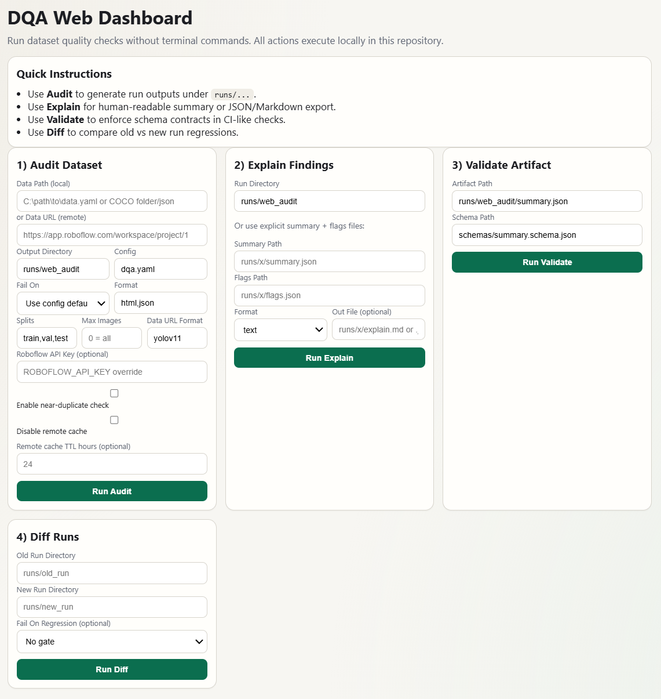

# Dataset Quality Analyzer

Dataset Quality Analyzer (DQA) is a read-only auditing tool for object-detection and segmentation datasets. It finds structural errors, distribution problems, suspicious geometry, duplicates, and split leakage before model training.

DQA supports local Ultralytics-style YOLO datasets, local COCO detection/segmentation exports, and remote Roboflow exports. It produces deterministic JSON artifacts and an optional HTML report suitable for local review or CI quality gates.

## Checks

DQA evaluates:

1. Annotation and file integrity
2. Class support, imbalance, and split drift
3. Bounding-box sanity, including boxes derived from polygons
4. Exact duplicates within and across splits
5. Optional perceptual near-duplicates
6. Train/validation/test leakage

Finding IDs and default severities are defined in [FINDING_CATALOG.md](FINDING_CATALOG.md). The complete v1 behavioral contract is in [V1_SPEC.md](V1_SPEC.md).

## Requirements

- Python 3.11 or newer
- `PyYAML`
- `jsonschema`
- `Pillow` for near-duplicate detection

Install the project from the repository root:

```powershell
python -m pip install .
```

Install optional near-duplicate support with `python -m pip install ".[near-duplicates]"`, or development dependencies with `python -m pip install -e ".[dev]"`.

## Quick start

Audit a local YOLO dataset:

```powershell
dqa audit --data "C:\path\to\data.yaml" --out "runs\audit_001"
```

Audit a local COCO export directory:

```powershell
dqa audit --data "C:\path\to\coco-export" --out "runs\audit_001" --config "dqa_seg.yaml"
```

Audit a Roboflow export:

```powershell
$env:ROBOFLOW_API_KEY="your_key"
dqa audit --data-url "https://app.roboflow.com/workspace/project/1" --out "runs\audit_001"
```

Use one configuration based on the dataset:

| Dataset | Configuration |
|---|---|
| YOLO or COCO detection | `dqa.yaml` |
| YOLO or COCO segmentation | `dqa_seg.yaml` |
| Segmentation where polygon-derived boxes create excessive noise | `dqa_seg_low_noise.yaml` |

## Audit options

Exactly one of `--data` and `--data-url` is required.

| Option | Purpose |
|---|---|
| `--data` | Local `data.yaml`, COCO JSON, or COCO export directory |
| `--data-url` | Remote Roboflow project/version URL |
| `--data-url-format` | Roboflow export format; default `yolov11` |
| `--roboflow-api-key` | API key override; otherwise uses `ROBOFLOW_API_KEY` |
| `--out` | Required output directory |
| `--config` | Configuration file; omitted uses built-in detection defaults |
| `--splits` | Comma-separated splits; default `train,val,test` |
| `--workers` | Concurrent image-hash workers from 1 to 32; default is up to 4 |
| `--max-images` | Stop after this many indexed images; `0` means all |
| `--near-dup` | Enable near-duplicate analysis for this run |
| `--format` | Comma-separated output formats; default `html,json` |
| `--fail-on` | CI threshold: `critical`, `high`, `medium`, or `low` |
| `--no-remote-cache` | Force a fresh Roboflow download |
| `--remote-cache-ttl-hours` | Reuse remote cache only while younger than this value |

Run `dqa audit --help` for the authoritative CLI syntax. `python -m dqa` remains equivalent when working from a source checkout.

For worker or application integration, call the same typed service used by the CLI:

```python
from pathlib import Path
from dqa.audit import AuditOptions, audit_dataset

result = audit_dataset(AuditOptions(data=Path("data.yaml"), out=Path("runs/audit_001")))
```

`AuditResult` returns the exit code and generated summary, flags, and index payloads without requiring stdout parsing.

## Output

Each run directory contains:

| File | Purpose |
|---|---|
| `index.json` | Deterministic dataset index and cache-key basis |
| `flags.json` | Atomic findings with stable fingerprints |
| `summary.json` | Run metadata, per-check counts, and gate result |
| `report.html` | Human-readable report when HTML output is enabled |
| `run.log` | Basic run outcome |

Reusing the same output directory enables incremental indexing. Unchanged image hashes and metadata are reused; unchanged YOLO label parses are reused as well. Use a new output directory when an entirely independent cold run is desired.

Image hashing uses bounded worker parallelism. Near-duplicate analysis uses an exact Hamming-distance BK-tree to avoid an unconditional all-pairs scan while preserving every match within the configured threshold. Highly similar datasets can still produce many pairs and findings.

The audit exits with:

- `0`: completed without a finding at or above the gate
- `1`: completed and failed the configured quality gate
- `2`: invalid arguments or configuration
- `3`: runtime or data-access failure

An exit code of `1` means the audit completed successfully but found blocking issues.

## Review and automation commands

Summarize a run:

```powershell
python -m dqa explain --run "runs\audit_001"
```

Compare two runs and optionally fail on regression:

```powershell
python -m dqa diff --old "runs\before" --new "runs\after" --fail-on-regression high
```

Validate generated artifacts:

```powershell
python -m dqa validate --artifact "runs\audit_001\summary.json" --schema "schemas\summary.schema.json"
python -m dqa validate --artifact "runs\audit_001\flags.json" --schema "schemas\flags.schema.json"
```

## Local dashboard

The repository includes a convenience dashboard for local use:

```powershell
python web_dashboard.py
```

Open `http://127.0.0.1:8787`. The dashboard invokes local DQA commands and must not be exposed as a production web service.



## CI

The workflow in `.github/workflows/dqa-ci.yml` runs tests, executes a smoke audit, validates its artifacts, and uploads the run directory. Use `--fail-on high` for the normal production-dataset gate or choose a different threshold explicitly.

Run the local test suite with:

```powershell
pytest -q
```

## Troubleshooting

- `unknown keys`: the configuration contains a key outside the v1 contract.
- `Data file not found`: verify the quoted absolute or repository-relative input path.
- Roboflow failure: verify the API key, project/version URL, requested export format, and network access.
- Near-duplicate check skipped: install Pillow; a completed check with zero findings means no candidates met the configured threshold.
- Excessive segmentation geometry warnings: use `dqa_seg.yaml`, or `dqa_seg_low_noise.yaml` when bounding-box checks are not useful.

## Project documentation

- [V1_SPEC.md](V1_SPEC.md): behavioral and artifact contract
- [FINDING_CATALOG.md](FINDING_CATALOG.md): stable finding IDs and severities
- [wiki.md](wiki.md): implementation map for contributors
- [BENCHMARKS.md](BENCHMARKS.md): development performance measurements and limits
- [docs/ADR-001-aws-alpha.md](docs/ADR-001-aws-alpha.md): accepted hosted-alpha AWS architecture and cost envelope
- `schemas/`: machine-readable output contracts

## License

MIT
