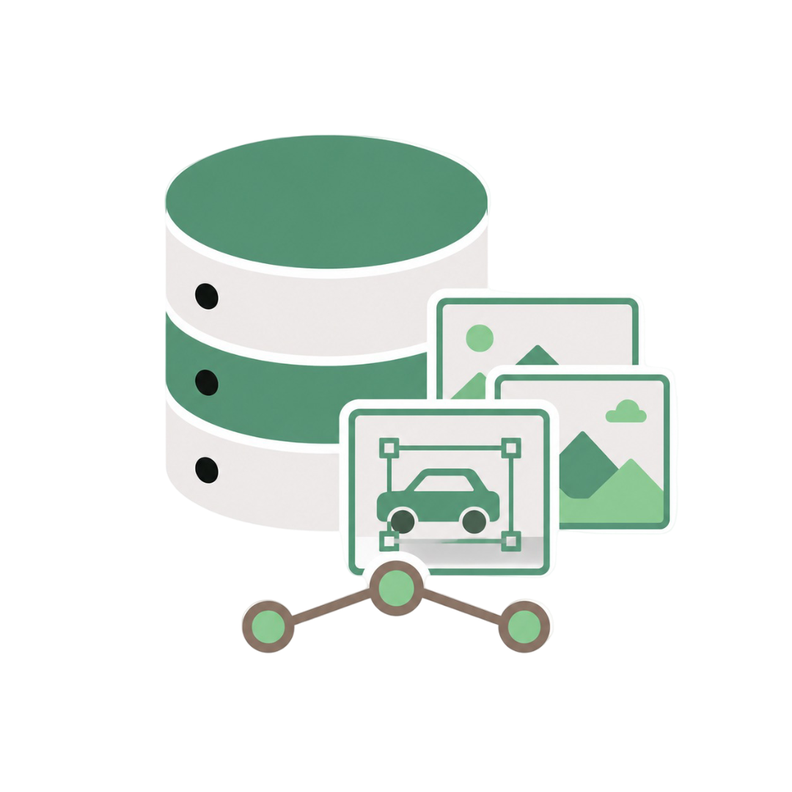
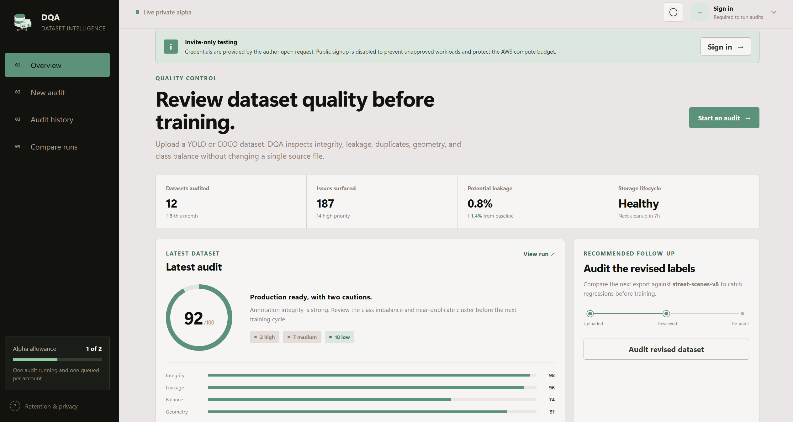

<p align="center">
  
</p>

<h1 align="center">Dataset Quality Analyzer</h1>

<p align="center">
  Find broken annotations, suspicious geometry, duplicate images, and split leakage before training.
</p>

<p align="center">
  <a href="https://d3jri7puiteob4.cloudfront.net/">
    
  </a>
  <a href="#local-quick-start">
    
  </a>
</p>

<p align="center">
  <strong>Private alpha:</strong> the hosted demo is invite-only. Request credentials from
  <a href="mailto:atikul.munna@northsouth.edu">atikul.munna@northsouth.edu</a>.
</p>



> The screenshot shows the hosted private-alpha interface. Dashboard values visible before a real audit are illustrative; authenticated audit history and artifacts are owner-scoped.

## What DQA does

Dataset Quality Analyzer (DQA) is a read-only auditing tool for object-detection and segmentation datasets. It validates the dataset without changing source images or annotations, then produces deterministic JSON artifacts and a human-readable HTML report.

DQA checks:

1. Annotation and file integrity
2. Missing, empty, malformed, or orphaned labels
3. Class support, imbalance, and split drift
4. Bounding-box and polygon-derived geometry sanity
5. Exact duplicates within and across splits
6. Optional perceptual near-duplicates
7. Train, validation, and test leakage

Finding IDs and default severities are defined in [FINDING_CATALOG.md](FINDING_CATALOG.md). The stable v1 behavior and artifact contract is documented in [V1_SPEC.md](V1_SPEC.md).

## Choose how to use it

| | Hosted private alpha | Local CLI |
|---|---|---|
| Best for | Browser-based evaluation and selected testers | Private datasets, automation, and unrestricted local use |
| Input | ZIP upload, up to 2 GiB compressed | Local YOLO/COCO data or a Roboflow export |
| Execution | Asynchronous AWS Batch worker | Your own machine or CI runner |
| Results | Owner-scoped history and temporary downloads | Files written to the selected output directory |
| Access | Credentials issued by the author; no public signup | No account required |
| Cost to user | None during the private alpha | Only the user's own compute |

The hosted service intentionally does not accept Roboflow API keys. Use the local CLI when auditing a Roboflow project or when a dataset must not leave your machine.

## Live private alpha

[Open the live DQA dashboard](https://d3jri7puiteob4.cloudfront.net/), then sign in with credentials issued by the project author. Public signup is disabled to prevent unapproved compute workloads while the service operates within a fixed AWS budget.

The hosted workflow is:

1. Sign in through Amazon Cognito.
2. Upload a ZIP archive directly to owner-scoped S3 storage.
3. Submit an audit and follow its queued/running state.
4. Review the result and download the generated artifacts.

Current alpha limits:

| Limit | Value |
|---|---:|
| Compressed upload | 2 GiB |
| Expanded dataset | 10 GiB |
| Images per audit | 25,000 |
| Near-duplicate analysis | 5,000 images |
| Audit runtime | 2 hours |
| Per account | 1 running and 1 queued audit |
| Global worker concurrency | 1 |
| Successful artifact availability | 7 days |

Source uploads expire automatically, failed/cancelled results have shorter retention, and old job metadata is removed. Do not treat the hosted alpha as permanent dataset or report storage.

## Local quick start

### Requirements

- Python 3.11 or newer
- `PyYAML`
- `jsonschema`
- `Pillow` for perceptual near-duplicate detection

Install from the repository root:

```powershell
python -m pip install .
```

For optional near-duplicate support:

```powershell
python -m pip install ".[near-duplicates]"
```

For development:

```powershell
python -m pip install -e ".[dev]"
```

Audit a local YOLO dataset:

```powershell
dqa audit --data "C:\path\to\data.yaml" --out "runs\audit_001"
```

Audit a local COCO export directory:

```powershell
dqa audit --data "C:\path\to\coco-export" --out "runs\audit_001" --config "dqa_seg.yaml"
```

Audit a Roboflow export:

```powershell
$env:ROBOFLOW_API_KEY="your_key"
dqa audit --data-url "https://app.roboflow.com/workspace/project/1" --out "runs\audit_001"
```

Choose a configuration based on the dataset:

| Dataset | Configuration |
|---|---|
| YOLO or COCO detection | `dqa.yaml` |
| YOLO or COCO segmentation | `dqa_seg.yaml` |
| Segmentation where polygon-derived boxes create excessive noise | `dqa_seg_low_noise.yaml` |

## CLI reference

Exactly one of `--data` and `--data-url` is required.

| Option | Purpose |
|---|---|
| `--data` | Local `data.yaml`, COCO JSON, or COCO export directory |
| `--data-url` | Remote Roboflow project/version URL |
| `--data-url-format` | Roboflow export format; default `yolov11` |
| `--roboflow-api-key` | API key override; otherwise uses `ROBOFLOW_API_KEY` |
| `--out` | Required output directory |
| `--config` | Configuration file; omitted uses built-in detection defaults |
| `--splits` | Comma-separated splits; default `train,val,test` |
| `--workers` | Concurrent image-hash workers from 1 to 32; default is up to 4 |
| `--max-images` | Stop after this many indexed images; `0` means all |
| `--near-dup` | Enable near-duplicate analysis for this run |
| `--format` | Comma-separated output formats; default `html,json` |
| `--fail-on` | CI threshold: `critical`, `high`, `medium`, or `low` |
| `--no-remote-cache` | Force a fresh Roboflow download |
| `--remote-cache-ttl-hours` | Reuse remote cache only while younger than this value |

Run `dqa audit --help` for the authoritative syntax. `python -m dqa` is equivalent when working from a source checkout.

Applications and workers can call the same typed service used by the CLI:

```python
from pathlib import Path
from dqa.audit import AuditOptions, audit_dataset

result = audit_dataset(
    AuditOptions(data=Path("data.yaml"), out=Path("runs/audit_001"))
)
```

`AuditResult` returns the exit code and generated summary, flags, and index payloads without requiring stdout parsing.

## Output and quality gates

Each run directory contains:

| File | Purpose |
|---|---|
| `index.json` | Deterministic dataset index and cache-key basis |
| `flags.json` | Atomic findings with stable fingerprints |
| `summary.json` | Run metadata, per-check counts, and gate result |
| `report.html` | Human-readable report when HTML output is enabled |
| `run.log` | Basic run outcome |

Reusing an output directory enables incremental indexing. DQA reuses unchanged image hashes, metadata, and YOLO label parses. Use a new output directory for an independent cold run.

Near-duplicate analysis uses an exact Hamming-distance BK-tree rather than an unconditional all-pairs scan. This preserves matches within the configured threshold while avoiding unnecessary comparisons on ordinary datasets.

Exit codes are stable for CI use:

| Code | Meaning |
|---:|---|
| `0` | Audit completed without a finding at or above the gate |
| `1` | Audit completed and the configured quality gate failed |
| `2` | Invalid arguments or configuration |
| `3` | Runtime or data-access failure |

An exit code of `1` means DQA completed successfully and found blocking issues; it is not an application crash.

### Review and automation

Summarize a run:

```powershell
python -m dqa explain --run "runs\audit_001"
```

Compare two runs and optionally fail on regression:

```powershell
python -m dqa diff --old "runs\before" --new "runs\after" --fail-on-regression high
```

Validate generated artifacts against their schemas:

```powershell
python -m dqa validate --artifact "runs\audit_001\summary.json" --schema "schemas\summary.schema.json"
python -m dqa validate --artifact "runs\audit_001\flags.json" --schema "schemas\flags.schema.json"
```

## Hosted architecture

The alpha uses a single-region, scale-to-zero AWS design:

```text
Browser
  ├── CloudFront → private S3 static frontend
  ├── Cognito → Authorization Code + PKCE
  ├── API Gateway → Lambda control plane
  │                  ├── DynamoDB job state and admission controls
  │                  ├── owner-scoped S3 upload/download grants
  │                  └── AWS Batch job submission
  └── direct upload → private S3

AWS Batch → one on-demand ECS Fargate worker
             ├── safely validate and extract the archive
             ├── run the same DQA engine as the CLI
             └── publish immutable attempt artifacts

EventBridge → terminal job-state monitor
CloudWatch → bounded logs, metrics, and alarms
ECR → immutable worker images
```

There is no NAT Gateway, load balancer, database server, or always-running worker. Audit compute starts only when a job exists and stops when it finishes. The infrastructure also applies lifecycle cleanup, a single-worker ceiling, project budgets, and an admission cutoff before the USD 50 total project ceiling.

Read [ADR-001](docs/ADR-001-aws-alpha.md) for the decision record and cost model, and [DEPLOYMENT.md](docs/DEPLOYMENT.md) for the smoke-gated release and rollback process.

## Security model

The hosted alpha is designed around a small, explicit trust boundary:

- Cognito uses Authorization Code with PKCE; the static frontend contains no client secret or AWS credential.
- Browser tokens remain in session storage.
- API Gateway validates authentication, while the application enforces ownership on jobs and objects.
- Dataset bytes upload directly to a private, owner-scoped S3 prefix instead of passing through Lambda.
- Workers accept a bounded job contract, not arbitrary commands, local paths, URLs, or user credentials.
- Archive extraction rejects traversal, links, special files, archive bombs, and datasets beyond declared limits.
- The worker container runs as a non-root user with a read-only root filesystem and finite ephemeral storage.
- Artifact download links are short-lived, and retained data expires automatically.

This is still a private alpha, not a compliance-certified service. Avoid uploading regulated or irreplaceable data, and retain your own copy of every dataset and report.

## Local dashboard and frontend development

The original local convenience dashboard remains available:

```powershell
python web_dashboard.py
```

Open `http://127.0.0.1:8787`. It launches local DQA commands and must not be exposed as a production web service.

The hosted static interface is in `web/`. Build its safe preview mode with:

```powershell
python scripts/build_web.py --mode preview
```

Preview mode exercises the interface without uploading data or pretending authentication exists. Live bundles receive only public API and Cognito configuration during the deployment workflow.

## Development and CI

Run the test suite:

```powershell
pytest -q
```

The GitHub Actions workflows run tests, build and scan the worker container, validate infrastructure, deploy immutable revisions, execute post-deployment smoke checks, and support rollback to a known commit SHA.

The DQA audit workflow also performs a smoke audit, validates the generated artifacts, and uploads the run directory. A production dataset gate can use `--fail-on high`, or another threshold chosen explicitly for the project.

## Project status

The CLI and hosted private alpha are functional. The hosted service is intentionally access-controlled while security/abuse review and load/cost validation continue. Public signup and broader availability should only be considered after those gates pass and the compute budget is deliberately increased.

## Troubleshooting

- `unknown keys`: the configuration contains a key outside the v1 contract.
- `Data file not found`: verify the quoted absolute or repository-relative input path.
- Roboflow failure: verify the API key, project/version URL, requested export format, and network access.
- Near-duplicate check skipped: install Pillow; zero findings from a completed check means no candidates met the configured threshold.
- Excessive segmentation geometry warnings: use `dqa_seg.yaml`, or `dqa_seg_low_noise.yaml` when polygon-derived bounding-box checks are not useful.
- Hosted sign-in unavailable: request an invite from the author; public account creation is intentionally disabled.
- Hosted audit rejected: check the displayed size/queue limits. Admission also closes when the project cost guard is active.

## Documentation

- [V1_SPEC.md](V1_SPEC.md): behavioral and artifact contract
- [FINDING_CATALOG.md](FINDING_CATALOG.md): stable finding IDs and severities
- [wiki.md](wiki.md): implementation map for contributors
- [BENCHMARKS.md](BENCHMARKS.md): performance measurements and limits
- [AWS architecture decision](docs/ADR-001-aws-alpha.md): hosted-alpha architecture and cost envelope
- [Container contract](docs/CONTAINERS.md): hardened production worker image
- [Deployment runbook](docs/DEPLOYMENT.md): release, smoke gate, and rollback
- [Operations runbook](docs/OPERATIONS.md): alarms, diagnostics, retention, recovery, and incidents
- [Security policy and review](SECURITY.md): private reporting, threat controls, findings, and accepted alpha risks
- [Hosted frontend](web/README.md): preview/live modes and browser security boundary
- [Terraform infrastructure](infra/terraform/README.md): reproducible, cost-capped AWS stack
- [`schemas/`](schemas/): machine-readable output contracts

## License

MIT
